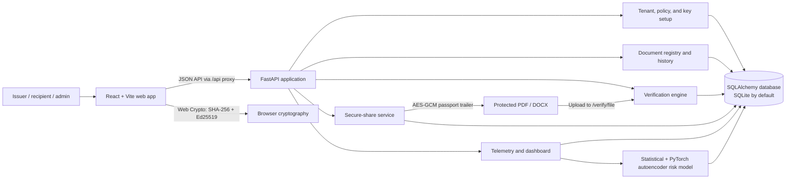
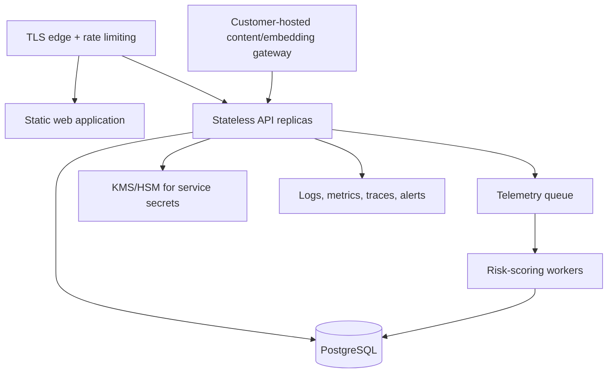

# DocShield Technical Architecture

> Repository assessment as of June 21, 2026. This document describes the code that exists today and separately identifies design intent or production gaps.

## 1. System purpose

DocShield is a document provenance and controlled-sharing system for PDF and DOCX files. It gives a document:

- a SHA-256 content fingerprint;
- an Ed25519-signed manifest containing issuer, policy, and AI-usage tags;
- an append-only, cryptographically chained signing history;
- an encrypted portable “passport” embedded in the downloadable file;
- secure-link access controls and access telemetry; and
- per-document anomaly scoring for unusual access behavior.

The product has two complementary trust modes:

1. **Portable protected file:** proves origin and detects changes when a compatible DocShield verifier can recover the passport.
2. **Secure link:** controls access and supplies telemetry, revocation, and anomaly detection while distribution remains in the DocShield flow.

These are different guarantees. A portable file is tamper-evident, not unremovable or universally trackable. A secure link provides stronger operational control, but that control ends if an authorized user obtains and redistributes an untracked copy.

## 2. Architecture map



### Runtime components

| Component | Implementation | Responsibility |
|---|---|---|
| Web client | React 18, TypeScript, Vite, React Router, TanStack Query, shadcn/Radix, Tailwind | Authentication UI, organization setup, document registration, verification, sharing, dashboards, audit views |
| Browser cryptography | Web Crypto API | Generate a development Ed25519 key pair, sign canonical manifests/events, and hash uploaded bytes with SHA-256 |
| API | FastAPI + Pydantic | HTTP contracts, orchestration, validation, error mapping, and OpenAPI docs |
| Persistence | SQLAlchemy; SQLite by default; asyncpg dependency included | Stores tenants, keys, manifests, raw document content, links, histories, telemetry, model state, verification logs, and audit logs |
| Cryptographic services | `cryptography` | Ed25519 verification, AES-256-GCM passport encryption, password/session helpers |
| Risk engine | PyTorch + online statistics | Builds access features, reconstructs expected behavior, assigns scores/reasons, and updates a per-document model |
| Local development | Root `npm run dev` orchestrator | Starts Uvicorn on `127.0.0.1:8000`, waits for readiness, then starts Vite on port 8080 |

### Frontend routes

- Public: landing page, sign-in/sign-up, and tokenized share page (`/s/:token`).
- Authenticated application: dashboard, documents, document detail/download, verifier, access events, API reference, settings, and setup.
- `ProtectedRoute` requires a frontend session; `OrgGate` requires organization context before entering the main app.
- The Vite development proxy maps frontend `/api/*` calls to FastAPI and removes the `/api` prefix.

### Backend API surface

| Area | Main endpoints | Behavior |
|---|---|---|
| Setup | `POST /setup` | Upserts tenant details, policy templates, and public keys |
| Documents | `POST/GET /documents`, `GET/DELETE /documents/{id}` | Registers and manages signed manifest records |
| Lifecycle | `POST /documents/{id}/events` | Appends a verified, hash-linked signing event |
| Content | `PUT /documents/{id}/content` | Stores original file bytes after fingerprint validation |
| Sharing | `POST /documents/{id}/share-links`, `GET /shares/{token}`, `GET /shares/{token}/download` | Issues tokenized links, checks access conditions, records opens/downloads, and serves a protected file |
| Verification | `POST /verify`, `POST /verify/file` | Verifies supplied passport data or extracts and verifies an embedded passport |
| Telemetry | `POST/GET /access-events` | Ingests events, scores risk, and returns a suspicious-event feed |
| Reporting | `GET /dashboard`, `GET /audit-export`, `GET /documents/{id}/share-analytics` | Aggregates activity, alerts, history, revocation, and verification state |
| Demo auth/settings | `/frontend/*` | File-backed user sessions and company settings for the current frontend |

## 3. Core data model

The registry is tenant-scoped. Its main entities are:

- **Tenant:** organization name, domains, administrator emails, and status.
- **Policy template:** named policy JSON belonging to a tenant.
- **Public key:** tenant-owned Ed25519 verification key with active/revoked status.
- **Document:** signed manifest, canonical manifest hash, original content fingerprint, policy, AI tags, current history tip, revocation state, and last verification result.
- **Document content:** file name, MIME type, size, and complete raw bytes. This is part of the implemented sharing demo and conflicts with the PRD’s “blind backend/no raw content” target architecture.
- **Signature history event:** issuer/recipient lifecycle event, actor key, manifest hash, previous-event hash, payload, signature, and calculated event hash.
- **Share link:** hashed bearer token, optional password hash, organization restriction, expiry, and status.
- **Access event:** open/download/failure activity, client/network fields, result, risk score, and reason codes.
- **Anomaly model state:** online feature statistics, serialized PyTorch weights, latest feature vector, score, and reasons for one document.
- **Verification and audit logs:** durable outcomes and administrative/action records.

Database tables are created automatically at FastAPI startup. Two access-event columns are patched through ad hoc `ALTER TABLE` statements; Alembic is listed as a dependency but no migration workflow is currently present.

## 4. Document registration and signing

### Registration flow

1. The browser reads the selected PDF or DOCX and computes `sha256:<hex>` over its exact bytes.
2. A document ID is derived from the first 16 hexadecimal fingerprint characters.
3. The client assembles a manifest containing schema version, tenant, document ID, issuer key ID, content fingerprint, policy, `NO_EXTERNAL_AI` tag, and timestamp.
4. The manifest is recursively key-sorted and serialized to compact JSON.
5. The browser signs those canonical bytes with Ed25519. In the current demo, the extractable private key is generated in-browser and persisted in `localStorage`.
6. The initial `issued` event references the manifest hash, is signed separately, and is sent with the signed manifest to `POST /documents`.
7. The backend retrieves the registered public key, verifies the manifest signature, validates the history, calculates canonical hashes, and stores the registry record.
8. The frontend then uploads the original bytes to the content endpoint for the secure-share/download demo.

### Canonicalization and signatures

Canonical JSON recursively sorts object keys, preserves list order, removes undefined values on the frontend, and emits compact UTF-8 JSON. The signature never signs its own signature field.

- Manifest identity: `SHA-256(canonical manifest JSON)`.
- Manifest authenticity: `Ed25519.sign(canonical manifest JSON)`.
- Event identity: `SHA-256(canonical event JSON without signature)`.
- Event authenticity: `Ed25519.sign(canonical event JSON without signature)`.
- History ordering: each event’s `previous_event_hash` must equal the preceding accepted event hash.
- History binding: every event’s `manifest_hash` must equal the registered manifest hash.

Revoking a document is represented as a signed history event and changes the document status. Revoked issuer/actor keys also affect verification.

## 5. How the “watermark” works

The current implementation is better described as an **encrypted embedded passport** than a conventional watermark.

### What is embedded

At download time, the backend constructs JSON containing:

- document ID;
- original SHA-256 fingerprint;
- complete signed manifest; and
- complete signed history chain.

The JSON is compactly serialized and encrypted with AES-GCM. The 256-bit AES key is the SHA-256 digest of `DOCSHIELD_EMBEDDING_SECRET`. A fresh 12-byte nonce is generated for each protected download, and fixed additional authenticated data (`docshield-embedded-document-v1`) domain-separates this use.

The output bytes have this form:

```text
[exact original file bytes]
[12-byte nonce + AES-GCM ciphertext/tag]
[8-byte big-endian encrypted-payload length]
[ASCII magic: DOCSHIELD-ENCRYPTED-V1]
```

This trailer is appended without changing the filename extension. Because the original byte range is untouched, extraction can recover the exact original and recompute its fingerprint.

### Verification of an embedded file

1. `/verify/file` checks for the trailer magic.
2. The preceding length field locates the encrypted payload.
3. AES-GCM authenticates and decrypts the passport. Altering the nonce, ciphertext, authentication tag, or authenticated context causes extraction to fail.
4. The verifier hashes only the preserved original byte range.
5. It validates registry identity, content fingerprint, manifest signature, history links/signatures, key status, document revocation, and requested policy operation.
6. It records the result and returns a state such as `valid`, `tampered`, `revoked`, `metadata_stripped`, `unknown_document`, or `invalid_signature`.

### Security properties and boundaries

What it provides:

- confidential passport contents to parties without the embedding secret;
- integrity/authentication of the embedded passport through AES-GCM;
- issuer authenticity through Ed25519;
- exact-byte tamper detection through SHA-256; and
- a portable policy/history package recoverable by DocShield.

What it does **not** provide:

- a visible recipient-specific watermark;
- steganography or resistance to deliberate trailer removal;
- continued tracking after an offline copy leaves the secure-link flow;
- survival through print/scan, screenshots, format conversion, flattening, or document reconstruction;
- independent third-party decryption, because all deployments need the same configured embedding secret; or
- standard PDF XMP/attachment/catalog embedding. Those redundant PDF-native locations are described in the design notes, not implemented in this repository.

The checked-in fallback secret is development-only. Production must require a high-entropy managed secret, support rotation/versioning, and avoid a shared global key across unrelated tenants.

## 6. Verification and policy enforcement

The verifier performs layered checks rather than treating a matching hash as sufficient:

1. Locate the registry document and tenant.
2. Compare submitted signed manifest with the registered manifest/hash.
3. Resolve the issuer public key and verify the Ed25519 manifest signature.
4. Validate every history event’s document ID, manifest hash, previous hash, actor key, signature, and ordering.
5. Compare the locally computed source fingerprint with the signed fingerprint.
6. Check key and document revocation.
7. Evaluate usage policy. For example, an external AI upload is denied when the policy says `external_ai_upload: blocked` or the manifest carries `NO_EXTERNAL_AI`.
8. Persist the outcome for reporting.

Policy tags are declarations understood by compatible tools; they are not self-enforcing in arbitrary AI products. Enforcement requires an integration at the upload gateway, browser, endpoint, or application that reads the tag/calls verification and honors the decision.

## 7. How anomaly detection works

Anomaly detection runs when an access event is inserted. It is scoped **per document**, not globally per tenant or user.

### Input features

For each event, the service derives eight behavior features from that document’s event history:

| Feature | Window / meaning | Possible reason code |
|---|---|---|
| `download_count_24h` | Downloads in 24 hours | `download_spike` |
| `download_count_1h` | Downloads in one hour | `burst_access` |
| `download_rate_15m` | Downloads per hour extrapolated from 15 minutes | `download_rate_spike` |
| `blocked_count_24h` | Blocked attempts in 24 hours | `blocked_attempts` |
| `distinct_countries_7d` | Unique countries in seven days | `new_geography` |
| `distinct_clients_7d` | Unique `(IP hash, user-agent hash)` pairs | `multi_client_clusters` |
| `minutes_since_previous_event` | Time since prior activity | `stale_activity` or `burst_access` |
| `country_novelty` | Current country unseen in the recent window | `new_geography` |

### Normalization

Each feature starts with a hand-selected prior mean and variance. As safe samples arrive, the service updates means and second moments online using Welford-style calculations. A variance floor prevents near-zero variance from making tiny differences explode. Z-scores are clipped to `[-5, 5]` and divided by five, producing approximately `[-1, 1]` model inputs.

### Neural model

The PyTorch autoencoder has an `8 → 8 → 3 → 8 → 8` shape:

- encoder: linear, ReLU, linear, Tanh;
- three-value bottleneck;
- decoder: linear, ReLU, linear; and
- Xavier-initialized weights with a fixed seed.

The model attempts to reconstruct normal feature vectors. Mean squared reconstruction error measures how unfamiliar the current pattern is. Model weights are serialized into the database for each document.

### Hybrid score and explanations

The service also computes a pure statistical error from squared normalized z-scores. During the first three samples it uses the statistical score alone; afterward it uses the larger of reconstruction error and `0.75 × statistical error`. This floor prevents an under-trained autoencoder from masking an obvious deviation.

The selected error `e` becomes a bounded score:

```text
score = round(100 × (1 - exp(-14 × e)))
```

- 0–49: low
- 50–79: medium and considered suspicious
- 80–100: high

Explanation codes are selected from features whose z-score crosses ±1, ranked using both z-score magnitude and model residual. At most three unique reasons are returned. A blocked event always puts `blocked_attempts` first; otherwise an unexplained nonzero score receives `model_deviation`.

### Online learning safeguards

The model trains for two Adam steps on each accepted learning sample (`lr=0.01`, weight decay, gradient clipping). Warm-up samples are always learned. After warm-up, only events scoring below 40 update the model/statistics, reducing the chance that obvious attacks become the new normal.

### Current limitations

- There is no labeled evaluation set, precision/recall target, calibration report, or drift monitoring.
- A separate tiny model per document has very little data for new or rarely accessed files.
- The database query loads the document’s full event history for every score; this will become expensive at scale.
- Country is supplied or inferred from headers, and client identity depends on potentially absent/spoofable values.
- Features include the just-inserted event, which is intentional for counts but should be covered by regression tests to prevent off-by-one misunderstandings.
- Model state uses `torch.load`; database write access must be trusted because unsafe serialized model blobs can be dangerous. A safer tensor-only format should be used in production.
- Scoring is synchronous in the access request path, so model/database latency directly affects opens and downloads.
- Thresholds and priors are hard-coded rather than tenant-configurable or empirically calibrated.

## 8. Secure sharing and telemetry

Share links use random bearer tokens; only a hash is stored. A link can require a password, tenant/organization match, and/or expiration. Public share metadata does not expose file bytes. Download authorization records access, then returns a newly passport-wrapped copy.

Telemetry records open, download, token failure, verification attempt, or blocked AI-upload actions together with time, link, network/client hints, result, and reason. Dashboard alerts reflect the latest risk state for documents scoring at least 50. Audit export combines the manifest, signing history, key/document revocation, all access events, current risk signal, and last verification summary.

## 9. Authentication, privacy, and trust boundaries

- The current `/frontend/*` authentication is a demo-oriented, file-backed subsystem rather than an enterprise identity provider. Session cookies are the frontend gate, while most core API endpoints do not enforce that session or tenant authorization.
- Development signing private keys are extractable and stored in browser `localStorage`; production keys should live in an HSM/KMS, OS keychain, smart card, or customer-controlled signing service.
- The PRD describes a blind backend that never receives raw content. The current secure-share implementation stores raw bytes in `document_contents`. A production decision is required: customer-host the content gateway as designed, or explicitly change the privacy claim and secure content storage accordingly.
- IP addresses may be stored in plaintext as well as hashed form. Retention, minimization, consent, regional processing, and access controls need a documented privacy policy.
- Exact byte hashing means benign reserialization by Word/PDF tooling produces a different fingerprint. A future normalized semantic fingerprint could improve resilience, but it would introduce format-specific canonicalization risk.

## 10. Deployment and operations

Current local deployment is a single FastAPI process and Vite development server backed by `docshield.db`. The Python package includes PostgreSQL support dependencies, but production configuration, migrations, object storage, queues, monitoring, backups, key management, rate limiting, CORS, and container/infrastructure definitions are not present.

Recommended production split:



## 11. Testing and engineering posture

The backend test suite covers setup, documents, sharing, verification, telemetry, request context, and frontend authentication. Frontend tests cover core DocShield pages and API/client context, with Playwright artifacts for an end-to-end demo. Useful next layers are cryptographic test vectors shared across Python/TypeScript, property tests for canonicalization/history chains, malformed passport fuzzing, model calibration fixtures, authorization tests, migration tests, and browser-based end-to-end coverage in CI.

## 12. Highest-priority technical next steps

1. Resolve the trust-model contradiction: move raw document handling to a customer-hosted gateway or revise the zero-content claim.
2. Replace demo auth and browser-stored private keys with tenant-authorized enterprise identity and managed signing keys.
3. Enforce authorization and tenant isolation on every core endpoint.
4. Replace the global development embedding secret with versioned, tenant-aware KMS-managed keys and a rotation format.
5. Add schema migrations, PostgreSQL production support, backups, rate limits, observability, and secret management.
6. Move anomaly scoring off the synchronous download path and evaluate it against a realistic labeled dataset.
7. Implement PDF-native redundant embedding or adopt an interoperable provenance standard such as C2PA where appropriate.
8. Add visible recipient-specific watermarking only if leak deterrence/attribution is a product requirement; keep it conceptually separate from the cryptographic passport.

## 13. Terminology to use accurately

- Say **“tamper-evident encrypted document passport”**, not “unremovable watermark.”
- Say **“policy declaration for compatible enforcement points”**, not “blocks every AI upload.”
- Say **“secure-link telemetry”**, not “tracks any copy everywhere.”
- Say **“online anomaly score”**, not “proven malicious behavior.”
- Say **“blind backend”** only after raw file storage is removed from the deployed architecture.
